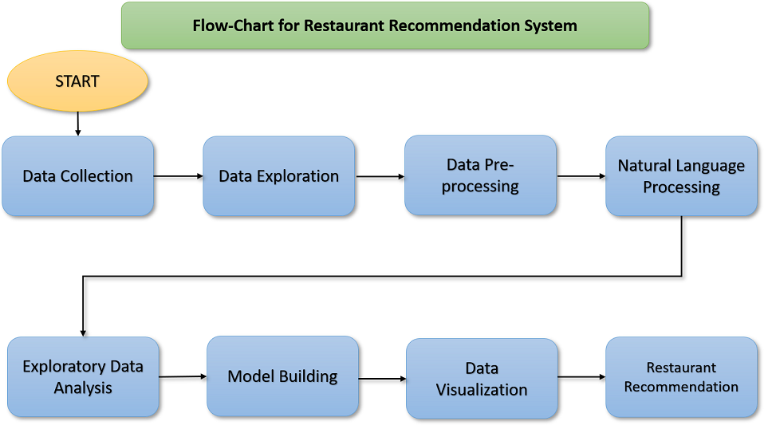

# Restaurant Recommendation System

### Technologies Used : Python, Machine Learning
### Group Members: B1_Pratik_49386, B1_Himanshu_49446
--------------------------------------------------------
### Flow-Chart
* Designed the flowchart to work on the Project.

### Required Libraries
    1. Numpy
    2. Pandas
    3. Matplotlib
    4. Seaborn 
    5. Scikit-learn
    6. GeoPy
    7. Folium
    8. NLTK
    9. TextBlob
    10. PyMongo

---------------------------------------------------------
### Data Collection
* Collected multiple datasets.
* Overviewed datasets to find apropriate dataset for our project.
* Finalized dataset to work further on it.
---------------------------------------------------------

### Understanding Data
* Thoroughly looked in the dataset and understood the features and datatypes.
* Understood the different features

|Feature | Description|
|--------|------------|
|url |This feature contains the url of the restaurant on the Zomato website|
|address |This feature contains the address of the restaurant in Bangalore|
|name |This feature contains the name of the restaurant|
|online_order |whether online ordering is available in the restaurant or not|
|book_table |table book option available or not|
|rate |contains the overall rating of the restaurant out of 5|
|votes |contains total number of upvotes for the restaurant|
|phone  |contains the phone number of the restaurant|
|location |contains the neighborhood in which the restaurant is located|
|rest_type |restaurant type|
|dish_liked |dishes people liked in the restaurant|
|cuisines |food styles, separated by comma|
|approx_cost(for two people) |contains the approximate cost of meal for two people|
|reviews_list |list of tuples containing reviews for the restaurant, each tuple consists of two values, rating and review by the customer|
|menu_item |contains list of menus available in the restaurant|
|listed_in(type) |type of meal|
|listed_in(city) |contains the neighborhood in which the restaurant is located|

----------------------------------------------------------------------------

### Data Preprocessing
* Removed unwanted and redundant features from the dataset.
* Removed null values as the percentage of those null values were very small.
* Removed duplicate values.
* Did Feature Engineering with all the remaining features to obtain data in required format.

### Exploratory Data Analysis
* With all the available data, some exploratory data analysis was done.
* Using different combinations of features for bar graph.
* As well as using geographical heatmaps to understand the locations of the restaurants.
----------------------------------------------------------------------------

### NLP - Sentiment Analysis
* As the restaurants had multiple reviews, we had to get sentiments for those reviews.
* For processing and sentiment analysis of those reviews we used NLTK library and TextBlob library.
* Using scores for all those reviews, we calculated the average score for each restaurant.

### Score
* Now, we had overall rating for the restaurant, number of votes and sentiment score.
* We had to consider all these scores as to get the better result.
* We computed the final score by multiplying all these three features, which will be used for recommendations.

### Limitations
* After all these steps, we understood there is one limitation of this model.
* The person in the middle of two clusters wil be shown restaurants from only one cluster which will it belong.
* It is not useful as the nearer better restaurant may be present in the other cluster.

### Overcoming Problem
* After analysing the above problem, I started studying different patterns of clusters, but couldn't find any better option.
* After a certain research I understood that, MongoDB geospatial indexing can be used in it.
* Using geospatial indexing, we could get the restaurants present in the certain radius from the given coordinates.

### MongoDB implementation
* Using PyMongo library, we loaded thedata into the MongoDB database collection.
* Then created array of coordinates as per reaquirement.
* Created geospatial indexes in the coordianates feature.
* Implemented the logic for getting top ten restaurants from mongodb in pymongo.

### Deployment
* The whole project is deployed on the AWS cloud.
* We used ec2 instance for deployment.
* Firstly we created the environment for the project on the instance by installing required packages.
* Installed MongoDB 4.4.9 using it's debian package.
* And the whole project was deployed.